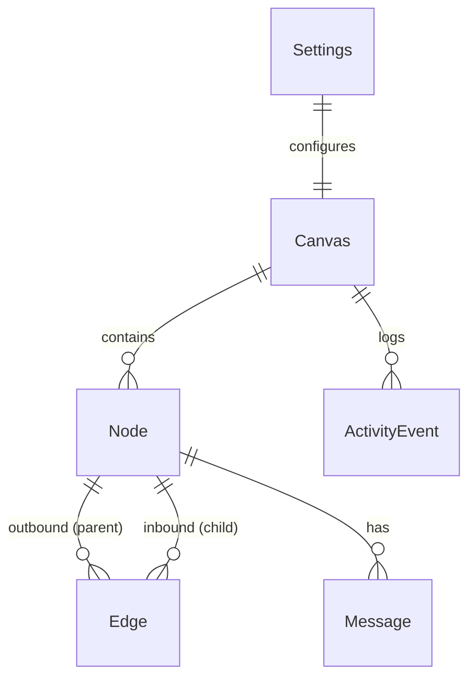
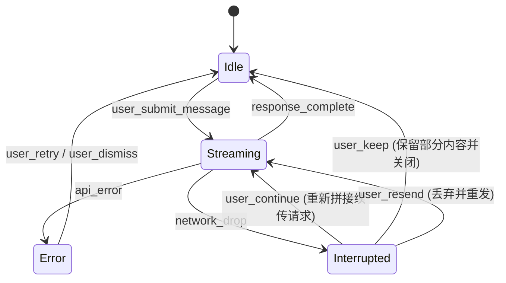
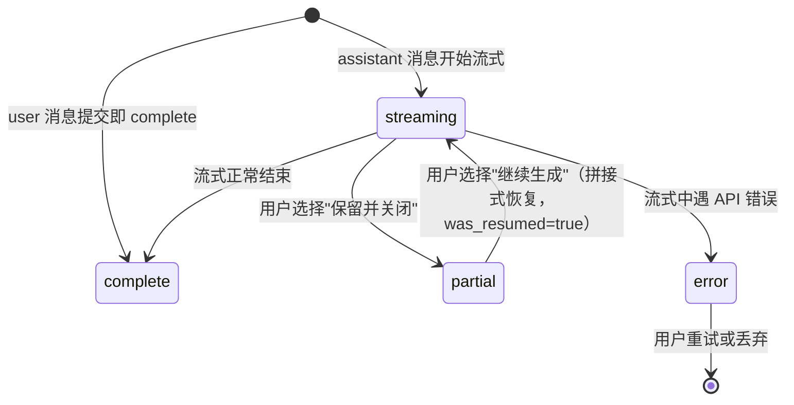
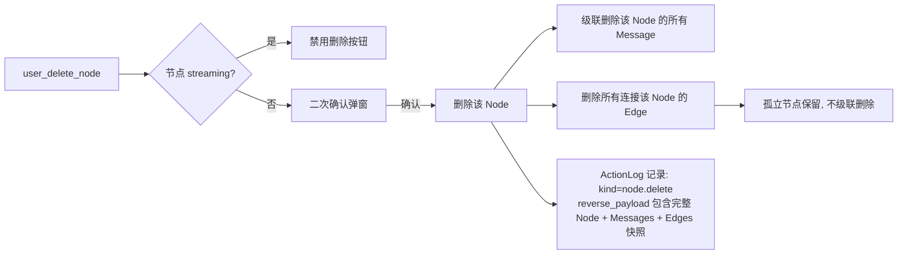

# 领域模型 v0.1

> 本版基于 Stage 0 决策 + Stage 1 三条旅程脚本抽取。会在 Stage 3 原型阶段修订。
>
> 核心原则提醒（PRD §1.5）：**AI 不感知画布**。所有"画布概念"只存在于产品层，AI 接收的永远是普通对话/写作请求。下面建模的实体都是产品层的，不是 AI 层的。

---

## 1. 实体清单

### 1.1 Canvas（画布）

| 字段 | 类型 | 约束 | 备注 |
|---|---|---|---|
| id | UUID | PK | MVP 期固定为单一画布 ID（PRD §3.3）|
| viewport_x | float | required, default 0 | 视野中心 x，单位为画布逻辑坐标 |
| viewport_y | float | required, default -200 | 视野中心 y |
| viewport_zoom | float | required, default 1.0, range [0.25, 2.0] | 缩放比例（25%-200%）|
| created_at | timestamp | required | |
| updated_at | timestamp | required | 任意持久化操作都更新 |

> **MVP 期 Canvas 表只有一行**。保留实体抽象是为了二阶段加多画布不重写。

### 1.2 Node（节点）

| 字段 | 类型 | 约束 | 备注 |
|---|---|---|---|
| id | UUID | PK | |
| canvas_id | UUID | FK → Canvas, required | |
| type | enum: `dialogue` \| `refined` \| `written` | required | 对话节点 vs 提炼节点 vs 撰写节点（PRD §5.2）|
| position_x | float | required | 画布逻辑坐标 |
| position_y | float | required | |
| width | float | default 380 | PRD §5.1 固定宽度，但保留字段以便未来调整 |
| collapsed | boolean | default false | true = 折叠态（PRD §5.1）|
| title | string | nullable, ≤30 chars | AI 生成的短摘要（每 3 条消息更新一次，Q3-4）|
| created_at | timestamp | required | |
| updated_at | timestamp | required | |
| last_focused_at | timestamp | nullable | Tab 键切换的依据（旅程 3 步骤 31）|

**派生属性（不持久化，运行时计算）：**
- `is_active`：是否当前活跃节点（每个 Canvas 最多一个，PRD §6.1）
- `streaming_state`：见下方 §3 状态机
- `inbound_edges` / `outbound_edges`：通过 Edge 表查询

### 1.3 Edge（边）

| 字段 | 类型 | 约束 | 备注 |
|---|---|---|---|
| id | UUID | PK | |
| parent_node_id | UUID | FK → Node, required | |
| child_node_id | UUID | FK → Node, required | |
| created_at | timestamp | required | |

**唯一约束：** `(parent_node_id, child_node_id)` 唯一。
**禁止自环：** `parent_node_id != child_node_id`。
**有向：** parent → child 表示子节点继承了 parent 的对话上下文（PRD §3.2）。

> **多父支持**：一个 child_node 可有多条 inbound edge（仅由"提炼/撰写多个节点"产生，PRD §3.2）。
> **多子支持**：一个 parent_node 可有多条 outbound edge（每次"分支"产生一个）。

### 1.4 Message（消息）

| 字段 | 类型 | 约束 | 备注 |
|---|---|---|---|
| id | UUID | PK | |
| node_id | UUID | FK → Node, required | |
| role | enum: `user` \| `assistant` | required | OpenAI 兼容协议的标准角色 |
| content | text | required, ≥1 char | assistant 消息可在流式中途被持久化为部分内容 |
| reasoning_content | text | nullable | 思考模式产出的 reasoning 字段（Q3-7）|
| created_at | timestamp | required | |
| sequence | integer | required, ≥0 | 节点内顺序，用于排序 |
| status | enum: `complete` \| `streaming` \| `error` \| `partial` | required, default `complete` | 见 §3 状态机 |
| was_resumed | boolean | default false | 是否经"继续生成"恢复（旅程 2 sad path 2 步骤 6）|
| token_count_estimate | integer | nullable | 用于上下文超长估算 |

> **MVP 期 user 消息一旦提交即 immutable**（无消息编辑功能）。assistant 消息在 streaming 状态下可被增量追加。

### 1.5 InheritedContext（继承上下文，逻辑实体）

> 这不是独立表，是 Node 实体的派生概念。建模在这里是为了让"分支时继承到哪里"有明确语义。

每个 Node（除 root 节点）有一个**对话历史快照**，由以下规则构成：

- 对**对话节点**（type = dialogue）的子节点：
  - 继承 = 父节点截至**分支动作发生那一刻**的所有 Message 的不可变快照
  - 实现方式：在 Edge 表里增加字段 `inherited_until_message_id`（指向父节点的某条 Message），运行时取该 Message 之前的所有消息
  - **关键不变量**：父节点在分支后新增的消息**不进入**子节点上下文（旅程 1 步骤 11-12，Q4-7）

- 对**提炼节点**（type = refined）：
  - 继承 = 提炼调用的输入材料 = 所有 inbound edge 父节点的对话历史（提炼时刻的快照）
  - 提炼节点的"对话起点" = 提炼输出本身（作为该节点的第一条 assistant 消息）
  - **关键不变量**：用户在提炼节点继续对话时，AI 上下文 = 提炼输出 + 该节点新增对话，**不带入原节点完整内容**（PRD §7.4，旅程 1 步骤 22）

**Edge 表字段补充（修订）：**

| 字段 | 类型 | 备注 |
|---|---|---|
| inherited_until_sequence | integer | nullable | 父节点 sequence 的截止点；null 表示该 edge 是提炼边（提炼节点的入边）|
| edge_kind | enum: `branch` \| `refine_input` | required | 区分分支边和提炼输入边 |

### 1.6 Settings（设置，单例）

| 字段 | 类型 | 约束 | 备注 |
|---|---|---|---|
| llm_base_url | string | required | OpenAI 兼容端点，如 `https://api.deepseek.com/v1` |
| llm_model | string | required | 如 `deepseek-reasoner` |
| llm_api_key | string | required, encrypted | 存储于 OS keychain（推荐）或加密文件 |
| thinking_mode_enabled | boolean | default false | 全局思考模式开关（Q3-7）|
| privacy_acknowledged | boolean | default false | 首次使用是否已勾选隐私提示（Q7-2）|
| context_window_threshold | float | default 0.8, range [0.5, 0.95] | 上下文超长拦截阈值，MVP 不暴露给用户调节（C4）|
| created_at | timestamp | required | |
| updated_at | timestamp | required | |

> **单例**：MVP 单用户单实例，Settings 表只有一行。

### 1.7 ActionLog（撤销栈，运行时实体）

> 这个**不持久化**（Q2-4：跨会话不保留 undo 历史）。仅在内存中存在。

| 字段 | 类型 | 备注 |
|---|---|---|
| id | UUID | 内存 ID |
| kind | enum | 见下方"动作分类" |
| forward_payload | object | 重做需要的数据 |
| reverse_payload | object | 撤销需要的数据 |
| created_at | timestamp | |

**栈深度 50（Q2-4），FIFO 淘汰**。

**动作分类（Q2-4 粒度 b：每个画布动作一步）：**
- `node.create` / `node.delete`
- `node.move` （单次拖拽合并为 1 步，Q2-5）
- `node.collapse` / `node.expand`
- `edge.delete` （删除节点级联断开时单独入栈？或合并入 `node.delete`——倾向合并）
- `node.refine` （提炼整体作为 1 步，包括新提炼节点 + N 条边）
- `multi.delete` （多选删除合并为 1 步，B3）

**不入栈的动作：**
- 视野缩放/平移（旅程 3 步骤 7-8）
- 切换活跃节点
- 折叠态点击展开（仅查看动作）
- AI 流式过程中的 token 累积

### 1.8 ActivityEvent（行为日志，本地）

> 用于支持 PRD §10 三个成功指标的本地观测（Q6-1：B+C 组合）。

| 字段 | 类型 | 备注 |
|---|---|---|
| id | UUID | |
| event_type | enum | `node_created` / `branch_created` / `refine_invoked` / `node_focused` / `message_sent` / 等 |
| payload | JSONB | 事件具体数据 |
| created_at | timestamp | |

**特性**：仅本地存储，不上报；用户可通过设置页"导出行为数据"获得 JSON 文件。

---

## 2. 关系总图

---

## 3. 状态机

### 3.1 Node.streaming_state（节点的 AI 调用状态，运行时）

**派生约束：**
- 节点处于 `Streaming` 时**不能删除**（旅程 3 步骤 22）
- 节点处于 `Streaming` 时**可以移动、折叠、切换活跃**（Q4-3 选 B）
- 节点处于 `Streaming` 时不会触发标题更新（避免基于不完整内容生成低质量标题）

### 3.2 Message.status（消息生命周期）

### 3.3 Node 的 collapse 状态

无复杂状态机。布尔切换：`collapsed = true | false`。
- 新建节点：`collapsed = false`（旅程 1 步骤 1）
- 用户主动折叠：`collapsed = true`（PRD-FIX-1，无自动折叠）
- 折叠态点击节点本体：`collapsed = false`（A3 决定：双击折叠态同时滚到最新消息）

### 3.4 删除节点的级联（Q2-3 选 B）

> **关键不变量**：删除子节点的反向操作必须能完整恢复——所以 `reverse_payload` 要带 Node + 所有 Message + 所有 inbound/outbound Edge。这对内存撤销栈有压力，但 MVP 单用户场景可接受。

---

## 4. 关键不变量（INV）

每个不变量追溯到 PRD 条款或具体旅程步骤号。

### INV-1：节点上下文边界（PRD §3.1）
节点对话上下文 = 该节点所有 Message + 该节点 inbound edges 携带的继承内容。**不会**通过其他渠道泄漏。
- 来源：旅程 1 步骤 11-12（父节点新增不流入子节点）

### INV-2：提炼/撰写节点的减熵（PRD §7.4）
对于 `type = refined` 或 `type = written` 的 Node，AI 调用上下文 = 该节点 Messages 序列。**不**展开 inbound edges 取原节点完整 Messages。
- 来源：旅程 1 步骤 22

### INV-3：分支继承的快照性
`Edge.inherited_until_sequence` 一旦写入就 immutable。父节点在分支后新增的 Message 不影响这个值。
- 来源：旅程 1 步骤 11-12，Q4-7

### INV-4：提炼边的多父结构（PRD §3.2）
当 `Edge.edge_kind = refine_input` 时，对应的 child_node 必须 `type = refined`，且该 child_node 至少有 1 条 inbound `refine_input` 边。
- 来源：旅程 1 步骤 19

### INV-5：节点删除不破坏图的合法性
删除一个节点后：
- 它的 outbound edges 全部删除（孙节点变成新的根/或保持其他父）
- 它的 inbound edges 全部删除
- 不会留下指向已删除节点的悬空边
- 来源：Q2-3 选 B，旅程 3 步骤 12

### INV-6：活跃节点唯一性（PRD §6.1）
任意时刻 `is_active = true` 的 Node 数量 ∈ {0, 1}，每个 Canvas 内独立。
- 来源：PRD §6.1

### INV-7：流式状态下的不可删除（旅程 3 步骤 22）
`streaming_state = Streaming` 的节点不可被 `node.delete` 操作。

### INV-8：消息序列单调
Node 内的 Message 按 `sequence` 严格单调递增；在该节点新增 Message 时 `sequence = max + 1`。

### INV-9：Settings 是否完备
没有有效 Settings（`llm_base_url` 或 `llm_model` 或 `llm_api_key` 为空）时，**禁止**任何 LLM 调用类操作（消息发送、提炼、标题生成）。
- 来源：旅程 2 sad path 5 步骤 21

### INV-10：节点位置可恢复
对任意 `node.move` 操作，撤销后 Node 的 `position_x` / `position_y` 必须**精确**回到操作前值（B2）。

### INV-11：思考内容不入下游
`Message.reasoning_content` 永远不进入：(a) 下一轮对话发给 LLM 的 messages 数组；(b) 提炼任务的输入材料；(c) 标题生成调用的输入；(d) Token 估算（Q3-7 c 项）。

### INV-12：单画布单例（MVP）
`Canvas` 表 row count = 1。任何创建第二个 Canvas 的尝试被拒绝。
- 来源：PRD §3.3

---

## 5. 与旅程的对应表（追溯性）

| 旅程步骤 | 触发的实体变更 | 对应 INV |
|---|---|---|
| 旅程1-步骤1（双击空白）| `Node.create` (type=dialogue) + `ActionLog` 入栈 | - |
| 旅程1-步骤2-3（输入并 AI 流式）| `Message.create`(role=user, complete) → `Message.create`(role=assistant, streaming) → `streaming` → `complete` | INV-1, INV-8 |
| 旅程1-步骤6（标题更新）| `Node.title` 更新（独立 LLM 调用，不入对话历史）| - |
| 旅程1-步骤7-8（分支）| `Node.create` (type=dialogue) + `Edge.create` (kind=branch, inherited_until_sequence=父节点当前 seq) | INV-3 |
| 旅程1-步骤11-12（回父节点继续聊）| 父节点新增 Message，不影响已存在子节点 | INV-3 |
| 旅程1-步骤15-19（提炼）| `Node.create` (type=refined) + N 条 `Edge.create` (kind=refine_input) + `Message.create` (role=assistant) 装提炼输出 | INV-2, INV-4 |
| 旅程1-步骤21-23（提炼节点继续对话）| `Message.create` 在提炼节点上；AI 调用上下文=该节点 Messages，不展开 inbound | INV-2 |
| 旅程2-sad-1（401 错误）| `Message.streaming` → `Message.error`，user 消息保留 | - |
| 旅程2-sad-2-步骤6（继续生成）| `Message.partial` → `Message.streaming`，`was_resumed=true` | - |
| 旅程2-sad-3（上下文超长拦截）| 前端 token 估算，不创建 Message | INV-11 不计 reasoning |
| 旅程3-步骤1-3（拖动 + 撤销）| `Node.move` + `ActionLog` 入栈，单次拖拽合并 | INV-10 |
| 旅程3-步骤9-13（删除 + 撤销）| `Node.delete` 级联清边 + `ActionLog` 反向 payload 含完整快照 | INV-5 |

---

## 6. 与 PRD 的对应表

| PRD 章节 | 领域模型对应 |
|---|---|
| §3.1 节点 | Node 实体，type 区分 dialogue/refined |
| §3.2 边 | Edge 实体 + edge_kind |
| §3.3 画布 | Canvas 实体（MVP 单例）|
| §4.1 种节点 | `Node.create` |
| §4.2 分支 | `Node.create` + `Edge.create(kind=branch)` |
| §4.3 提炼 | `Node.create(type=refined)` + N×`Edge.create(kind=refine_input)` |
| §4.4 继续 | 任意节点上的 `Message.create`（受 INV-1, INV-2 约束）|
| §5.1 折叠态 | Node.collapsed |
| §5.2 节点类型 | Node.type |
| §6.1 活跃节点 | INV-6（运行时派生） |
| §6.3 缩放 | Canvas.viewport_zoom |
| §7.4 上下文管理 | INV-1, INV-2, INV-11 + InheritedContext 逻辑 |

---

## 7. 待解决（暴露给 Stage 3 原型阶段）

- [ ] Node.title 更新触发到第 N 条消息的 N 是否包含 user 消息？倾向：包含（每 3 条消息更新 = 每 3 个 user/assistant 角色累加）
- [ ] 流式中的 assistant 消息持久化频率？每 token 一次太频繁，每 chunk 一次合理。倾向：每 chunk 一次 + 流式结束再确认一次
- [ ] InheritedContext 的实现方式：每次发请求时 join 查询 vs 把继承的消息 ID 列表缓存在 Edge 上？倾向 join 查询（简单，性能可接受）
- [ ] Edge 表的 `inherited_until_sequence` 字段在 `edge_kind=refine_input` 时是 null 还是 0？倾向：null
- [ ] ActionLog 在 `Settings` 改变（如切换 LLM provider）时是否清空？倾向：不清空（设置变更不影响画布数据）
- [ ] Message.reasoning_content 是否流式累积？流式期间每 chunk 推送 reasoning + content 两个字段。倾向：是
- [ ] 删除节点的 reverse_payload 中 Edge 快照需要包含 inherited_until_sequence——撤销时这些 sequence 仍在原父节点上有效（INV-3 保证）
- [ ] 多个 Canvas 的预留：MVP 期 Canvas 只有一行，但所有查询都要带 canvas_id 防漏；倾向：是

---

## 8. 给 Stage 3 原型的契约提示

原型阶段的 mock server 应实现的核心 API（仅做提示，正式契约在 Stage 4 定）：

- `GET /canvas` → Canvas + 所有 Nodes + 所有 Edges + 所有 Messages（首屏全量）
- `POST /node` → 创建节点（双击空白）
- `POST /node/{id}/message` → 发用户消息，SSE 流式返回 assistant 消息
- `POST /node/{id}/branch` → 从某条 message 分支
- `POST /refine` → 多节点提炼（请求体含 source_node_ids[] + intent_question）
- `PATCH /node/{id}` → 更新位置/折叠态/标题
- `DELETE /node/{id}` → 删除节点（级联断开）
- `POST /undo` / `POST /redo` → 撤销/重做（基于 ActionLog 内存栈）
- `GET /settings` / `PUT /settings`
- `POST /settings/test` → 测试 LLM 端点（D1）

> 注意：上述 API 在 Electron 应用中可能不走 HTTP，而走 Tauri/Electron IPC，但**契约形式仍按 OpenAPI 定义**（Stage 4），以便测试和调试。
