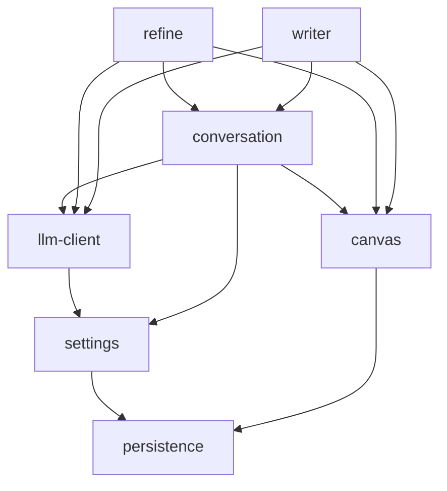

# 模块划分

> 按**限界上下文 / 聚合根**划分，不按技术分层（不是 controller / service / repository）。
>
> 划分原则（PRD §1.5 + Stage 0）：
> - 画布逻辑和 AI 逻辑彻底解耦——canvas 模块对 LLM 完全无知
> - 模块可并行实现，依赖拓扑严格单向
> - 每个模块对应 OpenAPI 一个 tag（除内部模块）

---

## 模块清单

### 1. `persistence-module` （基础设施模块）

**职责：** 提供本地存储抽象，所有有状态模块统一通过它读写数据。
**持有的实体：** 无（它是 storage adapter）。
**对外接口：** 内部 TypeScript 接口，不暴露 HTTP 端点。

```typescript
interface PersistenceAdapter {
  // KV 风格的简单接口，方便切换后端
  get<T>(table: string, id: string): Promise<T | null>;
  list<T>(table: string, filter?: Partial<T>): Promise<T[]>;
  put<T>(table: string, id: string, value: T): Promise<void>;
  delete(table: string, id: string): Promise<void>;
  // 事务用于级联删除（INV-5）
  transaction<T>(fn: (tx: PersistenceAdapter) => Promise<T>): Promise<T>;
}
```

**MVP 实现：**
- Stage 3 mock-server：内存对象（`Map<string, any>`）
- Stage 6 Electron 主进程：SQLite（推荐）或文件 JSON

**敏感字段加密：** Settings 中的 `llmApiKey` 走 OS keychain，不走通用 KV（settings-module 内部处理）。

**依赖：** 无（叶子模块）。

---

### 2. `settings-module`

**职责：** LLM 配置的读写 + 端点连通测试。
**持有的实体：** `Settings`（单例，对应 docs/02 §1.6）。
**对外接口：**
- `GET /api/settings` → 读取（apiKey 脱敏）
- `PUT /api/settings` → 写入（接受真实 apiKey）
- `POST /api/settings/test` → 调 baseURL + `/v1/models` 测连通（D1 决策）

**关键不变量：** INV-9（Settings 不完备时禁止 LLM 调用）。

**依赖：** `persistence-module`（持久化）。

**集成测试入口：** `tests/integration/settings/*.test.ts`

---

### 3. `canvas-module`

**职责：** 画布元数据、节点的 CRUD、边的隐式管理（仅由 branch/refine 操作产生，本模块不提供独立 edge 操作）、删除级联。

**持有的实体：** `Canvas`、`Node`、`Edge`（不持有 `Message` —— 由 conversation-module 持有）。

**对外接口：**
- `GET /api/canvas` → 全量快照（包含 nodes + edges + messages，但 messages 由 conversation-module 提供）
- `POST /api/nodes` → 创建节点
- `PATCH /api/nodes/{id}` → 更新位置/折叠/标题
- `DELETE /api/nodes/{id}` → 删除（级联断边，不删子孙）

**关键不变量：** INV-5、INV-6、INV-12。

**注意：**
- 此模块**不知道任何 LLM**——它只管节点和画布的几何/拓扑结构
- "标题" 字段由 `conversation-module` 调 LLM 生成后通过 PATCH 写入

**依赖：** `persistence-module`。

**集成测试入口：** `tests/integration/canvas/*.test.ts`

---

### 4. `llm-client-module` （内部模块）

**职责：** 封装 OpenAI 兼容协议的客户端。
**对外接口：** 内部 TypeScript 接口，不暴露 HTTP 端点。

```typescript
interface LLMClient {
  // 流式对话调用（reasoning + content 双路）
  streamChat(params: {
    messages: Array<{ role: 'user' | 'assistant'; content: string }>;
    enableReasoning: boolean;
  }): AsyncIterable<StreamEvent>;

  // 一次性调用（用于标题生成等短任务）
  completeChat(params: {
    messages: Array<{ role: 'user' | 'assistant'; content: string }>;
    maxTokens?: number;
  }): Promise<string>;

  // Token 估算（C3 决策：单一保守系数）
  estimateTokens(text: string): number;

  // 健康检查（D1：调 /v1/models）
  ping(): Promise<{ ok: boolean; models: string[] }>;
}
```

**关键约束（INV-11）：** 调用方传入的 messages 数组**永远不包含** `reasoningContent`——这层守卫在 conversation-module 的上下文组装函数里实现，llm-client 只负责把它收到的 messages 原样发给 LLM。

**依赖：** `settings-module`（读 baseURL/model/apiKey）。

**集成测试入口：** 不写独立测试（通过 conversation/refine 的集成测试间接覆盖）。

---

### 5. `conversation-module`

**职责：**
- 节点内的消息（user + assistant）持久化
- 上下文组装（INV-1, INV-2, INV-3, INV-11）
- 流式处理 + 节点标题自动生成（每 3 条消息）
- 分支动作（创建子节点 + 携带快照点的边）

**持有的实体：** `Message`。

**对外接口：**
- `POST /api/nodes/{id}/messages` → SSE 流式
- `POST /api/nodes/branch` → 分支

**核心内部函数：**

```typescript
// 上下文组装（最关键的 INV 守卫所在）
function assembleContext(nodeId: string): Promise<LLMMessages> {
  // 1. 读取该节点的 type
  // 2a. dialogue 类型：递归向上 join 父链 messages（按 inherited_until_sequence 截止）
  // 2b. refined 类型：仅取该节点自己的 messages（不展开 inbound edges）
  // 3. 严格剥离每条消息的 reasoningContent 字段（INV-11）
  // 4. 返回纯净的 OpenAI 协议 messages 数组
}
```

**依赖：** `canvas-module`（读节点/边）、`llm-client-module`（调 LLM）、`settings-module`（读思考模式开关）。

**集成测试入口：** `tests/integration/conversation/*.test.ts`

---

### 6. `refine-module`

**职责：** 提炼任务的两步流程（创建节点 → 流式拉取）+ 多源材料拼装。

**持有的实体：** 不持有持久化实体。提炼节点 / 边由它创建，但归属 canvas-module 管理。

**对外接口：**
- `POST /api/refine` → 创建提炼节点 + 边 + 流式 token
- `GET /api/refine/stream/{token}` → 拉取流式提炼内容

**核心内部函数：**

```typescript
// 提炼任务的输入组装
function assembleRefineInput(sourceNodeIds: string[], intent: string | null): Promise<LLMMessages> {
  // 1. 读取每个源节点的 messages
  // 2. 严格剥离 reasoningContent（INV-11）
  // 3. 拼装成 system prompt + 用户问题（用户问题 = intent ?? 默认综合性提炼）
}
```

**关键不变量：** INV-2（提炼节点继续对话时不展开父链——这条 INV 的守卫主要在 conversation-module 的 assembleContext，但提炼节点的"初始消息"由 refine-module 写入）、INV-4（提炼边的多父结构合法性）。

**依赖：** `canvas-module`（创建提炼节点/边）、`conversation-module`（读源节点 messages、写提炼输出消息）、`llm-client-module`、`settings-module`。

**集成测试入口：** `tests/integration/refine/*.test.ts`

---

### 7. `writer-module`

**职责：** 撰写任务的两步流程（创建节点 → 流式拉取）+ 多源材料拼装 + 拟人化改写。

**持有的实体：** 不持有持久化实体。撰写节点 / 边由它创建，但归属 canvas-module 管理。

**对外接口：**
- `POST /api/write` → 创建撰写节点 + 边 + 流式 token
- `GET /api/write/stream/{token}` → 拉取流式撰写内容

**核心内部函数：**

```typescript
// 撰写任务的输入组装
function assembleWriteInput(sourceNodeIds: string[], writingRequest: string | null): Promise<LLMMessages> {
  // 1. 读取每个源节点的 messages
  // 2. 严格剥离 reasoningContent（INV-11）
  // 3. 拼装成 system prompt（含写作原则+拟人化手法+禁止事项）+ 用户写作要求
}
```

**关键不变量：** INV-2（written 节点继续对话时不展开父链——同 refined 的处理）、INV-4（write_input 边的多父结构合法性）。

**与 refine 的关键差异：**
- writer 输出第一人称叙事文章（非结构化纲要）
- 系统 prompt 内嵌拟人化改写规则（session-writer + humanizer-rewrite 合并为单次 LLM 调用）
- temperature 0.8（写作需要创造力；refine 用 0.3）
- 支持用户自定义写作维度：文体、语气、侧重、长度、受众

**依赖：** `canvas-module`（创建撰写节点/边）、`conversation-module`（读源节点 messages、写撰写输出消息）、`llm-client-module`、`settings-module`。

**集成测试入口：** `tests/integration/writer/*.test.ts`

---

## 依赖拓扑



**实现顺序（叶子优先）：**
1. `persistence-module` （无依赖）
2. `settings-module` 和 `canvas-module` （并行可做，都只依赖 persistence）
3. `llm-client-module` （依赖 settings）
4. `conversation-module` （依赖前三个）
5. `refine-module` （依赖前四个）
6. `writer-module` （依赖前四个，与 refine 并行）

实现完成的定义：对应模块的所有集成测试从 `skip` 变 `pass`。

---

## 与 OpenAPI 契约的对应

| OpenAPI tag | 实现模块 |
|---|---|
| `canvas` | canvas-module |
| `nodes` | canvas-module |
| `messages` | conversation-module |
| `refine` | refine-module |
| `writer` | writer-module |
| `settings` | settings-module |

`llm-client-module` 和 `persistence-module` 不直接暴露 HTTP，是内部模块。

---

## 模块边界审查（避免常见陷阱）

**问：节点标题为什么由 conversation-module 生成而不是 canvas-module？**
答：标题是基于对话内容的 LLM 派生物，需要 llm-client 调用——属于 conversation 域。canvas-module 只持有 title 字段不解释它的语义。

**问：提炼节点的"边"由 canvas 还是 refine 持有？**
答：边数据归 canvas（实体所有权）；但**创建动作**由 refine 触发。canvas-module 提供 `createEdge` 内部 API，不暴露 HTTP——边只能通过 branch 或 refine 间接产生（PRD §3.2 决策：禁止自由跨节点连线）。

**问：思考内容（reasoning）的"剥离"在哪一层？**
答：网络层（SSE）已分两个独立 event 类型。但内存中的 Message 对象存了 reasoningContent 字段。**剥离责任在 conversation-module 的 `assembleContext`**——它返回给 llm-client 的 messages 数组**永远不带** reasoningContent。这是 INV-11 的工程实现锚点。

**问：上下文超长拦截在哪？**
答：conversation-module 的 `assembleContext` 完成后，调 llm-client.estimateTokens，超阈值则抛 `ContextOverflowError`，前端收到 HTTP 413。

---

## Stage 5 暴露的待解决项

- [ ] `assembleContext` 在父链很深时的查询性能——MVP 期允许 N 次 JOIN，Stage 6 在 Electron + SQLite 下可加索引或 CTE
- [ ] `llm-client.estimateTokens` 的实现方式：MVP 用 C3 决策的字符 × 系数；Stage 6 可考虑接入 tiktoken
- [ ] 多个 conversation 并发流式时，是否需要队列控制？MVP 期无队列（每个节点独立流式连接），Stage 6 看真实 LLM provider 的限流再决定
- [ ] `refine-module` 创建提炼节点时，节点位置（几何中心+避让）由前端算还是后端算？当前 mock 是后端固定坐标，前端覆盖。Stage 6 倾向：后端只给几何中心，前端做避让和最终落位
